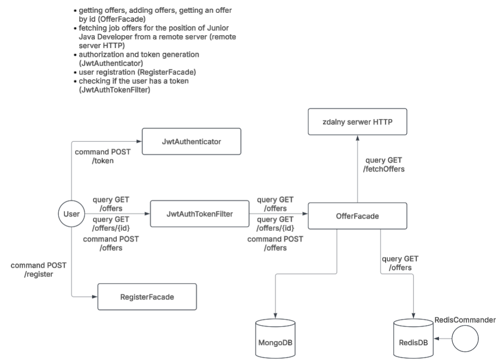

# JobOffers for Junior Java Developers

[](https://opensource.org/licenses/MIT)

`JobOffers` is a web application designed to aggregate job offers specifically for Junior Java Developers from various online sources. The primary goal is to provide a centralized platform with up-to-date job listings from diverse websites and applications, simplifying the job search process.

## Project Description

This application automates the collection of job offers, ensuring that Junior Java Developers have access to the latest opportunities in their field. It features robust backend services for data retrieval, storage, and management, along with API endpoints for seamless integration.

This project uses a modular monolithic application architecture with elements of hexagonal principles.

## Features

-   **Automated Job Offer Aggregation**: Fetches job listings from multiple websites and applications.
-   **Junior Java Developer Focus**: Tailored job offers relevant to entry-level Java developers.
-   **RESTful API**: Provides endpoints for accessing and managing job offer data.
-   **Data Storage**: Utilizes MongoDB for efficient data storage and retrieval.
-   **Filtering and Search**: Enables users to filter and search job offers based on various criteria.
-   **Security**: Implements JWT authentication for secure access to API endpoints.
-   **Scheduling**: Uses Spring Scheduler for periodic job offer updates.
-   **Caching**: Redis integration for improved performance and reduced database load.
-   **Containerization**: Docker and Docker Compose for easy deployment and scalability.

## Architecture



* The C3 diagram above presents main application components and module dependencies.

## Tech

JobOffers is developed using the following technologies:

**Core:**

|                       |                                                                                                                                                                                                                            |
| :-------------------- | :----------------------------------------------------------------------------------------------------------------------------------------------------------------------------------------------------------------------- |
| **Backend** |                                                                |
|                       | Spring Boot (REST Controllers, Test, Data MongoDB, Validation, Security, JWT, Spring Scheduler)                                                                                                                            |
| **Database** |                                                                |
|                       | MongoDB, MongoExpress                                                                                                                                                                                                  |
| **Containerization** |    |
|                       | Docker, Docker Compose, Docker Desktop                                                                                                                                                                                 |
| **Testing** |         |
|                       | Wiremock, Testcontainers, MockMvc, Awaitility, JUnit5, Mockito, AssertJ, SpringBootTest, SpringSecurityTest                                                                                                               |
| **Logging** |                                                                                                                                             |
|                       | Log4j2                                                                                                                                                                                                               |
| **Networking** |    |
|                       | RestTemplate, JSON, HTTP                                                                                                                                                                                               |
| **Utilities** |     |
|                       | Lombok, Redis (Jedis, Redis-Commander)                                                                                                                                                                                 |
| **Build Tool** |                                                                                                                                                 |
|                       | Maven                                                                                                                                                                                                                  |
| **Version Control** |   / GitLab                                                                     |
|                       | Git, GitHub/GitLab                                                                                                                                                                                                   |
| **IDE** | IntelliJ Ultimate                                                                                                                                                                                                    |
| **API Documentation** |                                                                                                                                             |
|                       | Swagger                                                                                                                                                                                                                |
| **CI/CD** |                                                                                                                                             |
|                       | Jenkins                                                                                                                                                                                                                |
| **Project Management**|                                                                                               |
|                       | SCRUM, Jira                                                                                                                                                                                                            |
| **Dev. Practices** | Code Review, Pair Programming                                                                                                                                                                                        |

## Installation and Setup

1.  **Clone the Repository:**

    ```bash
    git clone [https://github.com/Senegalion/JobOffers.git](https://github.com/Senegalion/JobOffers.git)
    ```

2.  **Navigate to the Project Directory:**

    ```bash
    cd JobOffers
    ```

3.  **Build and Run with Docker Compose:**

    ```bash
    docker-compose up --build
    ```

    This will start the application, MongoDB, MongoExpress, and Redis using Docker containers.

4.  **Configuration:**

    -   Environment variables are managed within the `docker-compose.yml` file.
    -   Adjust configurations for MongoDB, Redis, and other services as needed.

5.  **Access the Application:**

    -   The application will be accessible at `http://localhost:8082`.
    -   MongoExpress will be accessible at `http://localhost:8081`.
        -   **Note:** MongoExpress requires login. Use `admin` as username and `pass` as password.
    -   Redis commander is accessible at `http://localhost:8083`
    -   Swagger UI will be accessible at `http://localhost:8082/swagger-ui/index.html`

## Usage

-   Use the provided REST API endpoints to access and manage job offer data.
-   Utilize Swagger UI for API documentation and testing.
-   Monitor the application and database using MongoExpress and Redis Commander.

## Contribution

Contributions are welcome! Please follow these steps:

1.  Fork the repository.
2.  Create a new branch for your feature or bug fix.
3.  Commit your changes.
4.  Push your changes to your fork.
5.  Submit a pull request.

## License

This project is licensed under the [MIT License](LICENSE).

## Author

[Senegalion](https://github.com/Senegalion)

## Contact

For questions or feedback, please contact me via [email](mailto:lupelikan@gmail.com).

## Acknowledgments

-   Shields.io
-   Badges 4 README.md
